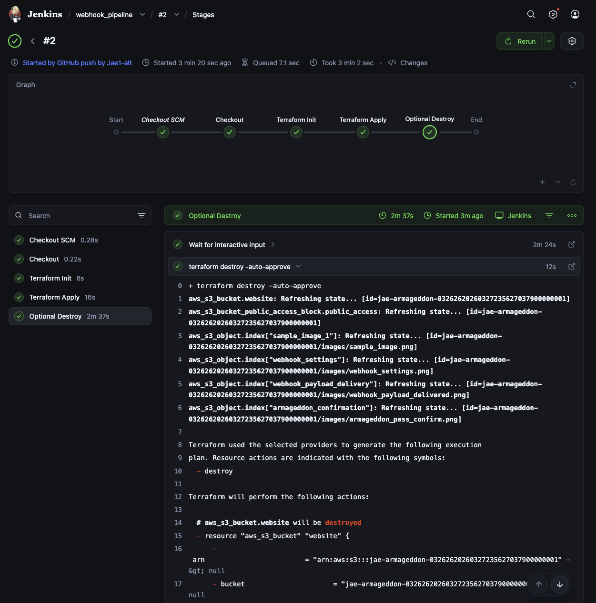
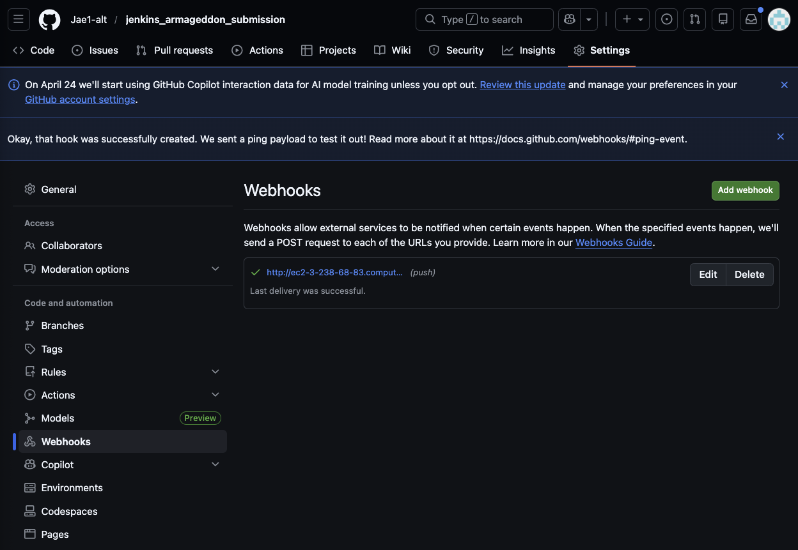
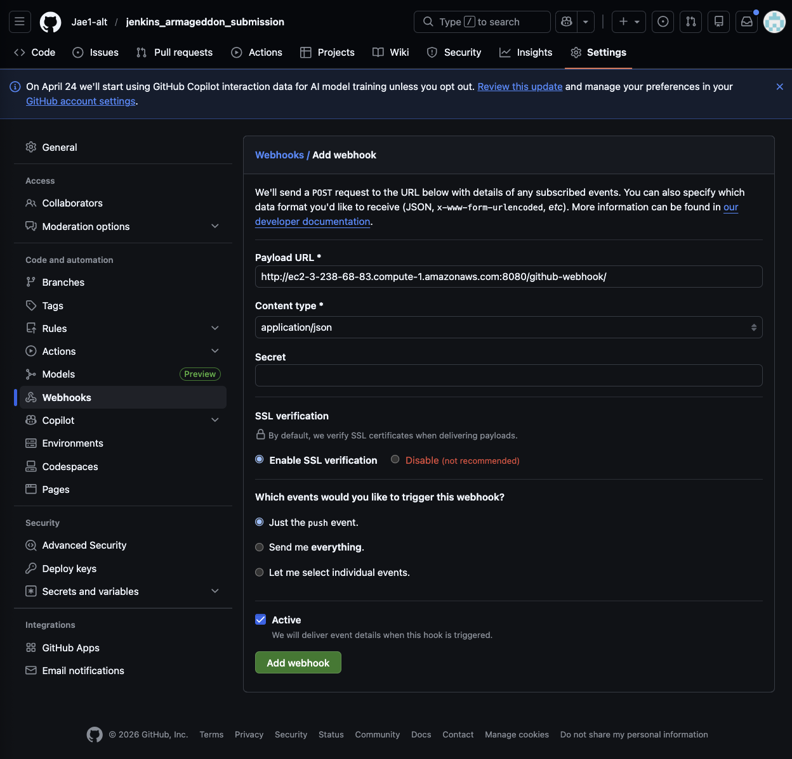
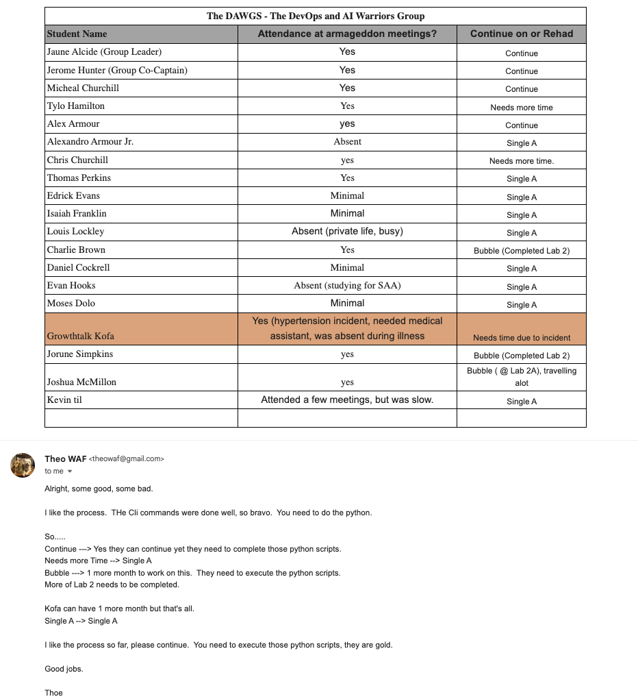

## Jenkins - Github via GitHub Webhook
---
This simple excersise that illustrated the possible integration between Jenkins and GitHub using a webhook.

The [images](./images/) folder contains images with proof of:
- screenshot: working webhook trigger (empty or otherwise)
- screenshot: successful TF deployment via jenkins
- screenshot: theo's approval of Armageddon submission
- text file/markdown/picture: Armageddon repo link
- all text/image files uploaded in s3 bucket

The [0.More_information](./0.More_information) file contains the [Armageddon repo](./0.More_information/Armageddon_repo.md) and the [info to create a custom jenkins docker image](./0.More_information/creating_custom_jenkins_image.md) files.

### Proofs:

- screenshot: working webhook trigger (empty or otherwise) & successful TF deployment via jenkins

- WebHook Payload Delivery:

- WebHook Settings:

---
---

- screenshot: theo's approval of Armageddon submission

---
---

- Armageddon repo link: [Armageddon repo](./0.More_information/Armageddon_repo.md)

---